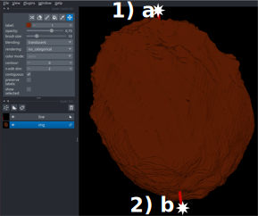

# ZF_PF_Geometry
  
This library provides tools to analyze geometric properties of zebrafish pectoral fins.  

## Installation

To use this library, clone the repository and install it locally in editable mode:  

```bash
# Clone the repository
git clone https://github.com/Coolix99/ZF_PF_Geometry
cd ZF_PF_Geometry

# Install in editable mode
pip install -e .
```

## Usage

The pipeline consists of the following steps:
1. Orientation: the PD and AP axis are manualy determined.
2. Center line: in the midle of the fin in PD direktion a midline will be semi-automaticaly determined.
3. Surfaceconstruction.
4. Coordinate system.
5. Thickness

After that one should check manually wheter the surfaces look good, if not one should retry. 

TODO example code

### Orientation

TODO explain input

There will be a napari viewer opened. It should show all specified images.

1. Rotate the fin in such a way that you look along the DV axis. 
   Than click in the middle of the proximal end of the fin and press 'a' on the keyboard. Second click at the distal tip and press 'b'.
   A red line should appear.



2. Rotate such that the distal tip points to you. Click left, press 'c'; click right, press 'd'.
    A green line appears.


3. Rotate to have a side view. Click proximal, press 'e'; click distal, press 'f'.
    A blue line should appear. To finish the session eigther close the viewer, press q or if you want to indicate wheter the fin is from left or right side press 'r' or 'l'.


### Centerline
